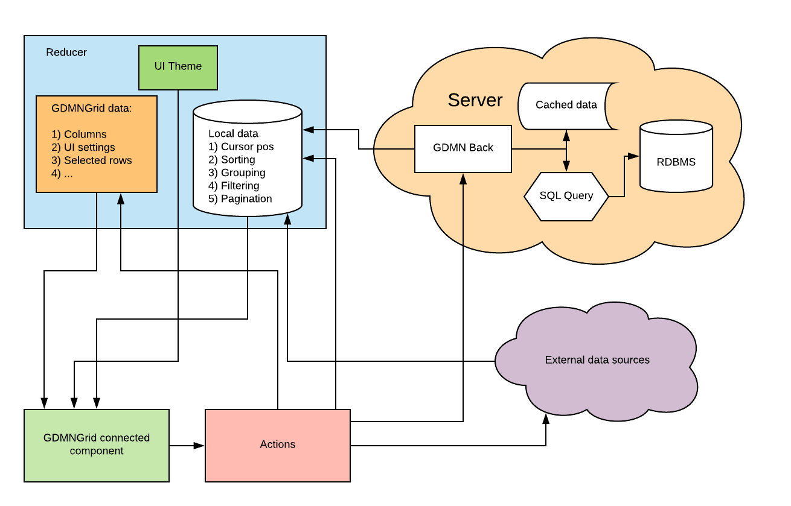

# GDMNGrid

## Требования

1. Прямоугольная таблица на экране из строк и столбцов (колонок) для отображения набора данных. Простейший набор данных -- одна таблица из реляционной БД. В таком случае строки -- это её записи, а столбцы -- поля. Строки могут иметь нумерацию, которая выводится в первой колонке. Клетка -- пересечение строки и столбца.
1. Колонки могут иметь заголовок, который фиксированно располагается в первой строке таблицы. В заголовке, как правило, выводится наименование поля.
1. В клетке могут выводиться данные одного или нескольких полей, или результат выполнения одной или нескольких функций над данными, включая агрегатные функции. Форматирование значений полей при выводе на экран -- это частный случай выполнения функции преобразования данных в строковое представление. Например, дата преобразуется в строку вида дд.мм.гггг.
1. В нижней части таблицы может фиксированно выводиться строка Итого. Как правило, в строке Итого выводятся результаты агрегатных функций по данным колонки (Сумма, Количество, Среднее и т.п.), а так же служебная информация: количество записей в наборе, количество выделенных записей и т.п.
1. Одна или несколько первых и/или последних колонок в таблице могут быть фиксированными, т.е. постоянно находиться на экране и не сдвигаться при прокрутке влево-вправо. 
1. Строки таблицы могут группироваться. Группы могут быть вложенными. По группам могут выводиться промежуточные Итого (в этом случае строки с промежуточными итогами располагаются вместе со строками данных). Группы могут сворачиваться и разворачиваться. 
1. Колонки таблицы могут группироваться. Группы могут быть вложенными. По группам могут выводиться промежуточные Итого (в этом случае колонки с промежуточными итогами располагаются вместе с колонками данных). Группы могут сворачиваться и разворачиваться. 
1. Внутри строки и клетки таблицы могут располагаться объекты: графики, фото, видео и т.п., в том числе и другая таблица. Связанная или не связанная с данными текущей записи или поля.
1. Визуальные настройки грида определяются следующим образом: Встроенные стили → Визуальная тема приложения → Визуальные стили данных → Кастомизированные стили конкретного компонента.
1. Пользователь имеет возможность настраивать любые визуальные настройки: менять ширину и порядок колонок, цвета, шрифты и т.п.
1. Параметры визуального отображения данных (цвет фона, шрифт и т.п.) могут зависеть от данных (условное форматирование).
1. Компонент предоставляет интерфейс для сортировки, фильтрации, поиска и группировки данных.

## Потоки данных GDMNGrid

## Используемые библиотеки

* React-virtualized
* React-draggable
