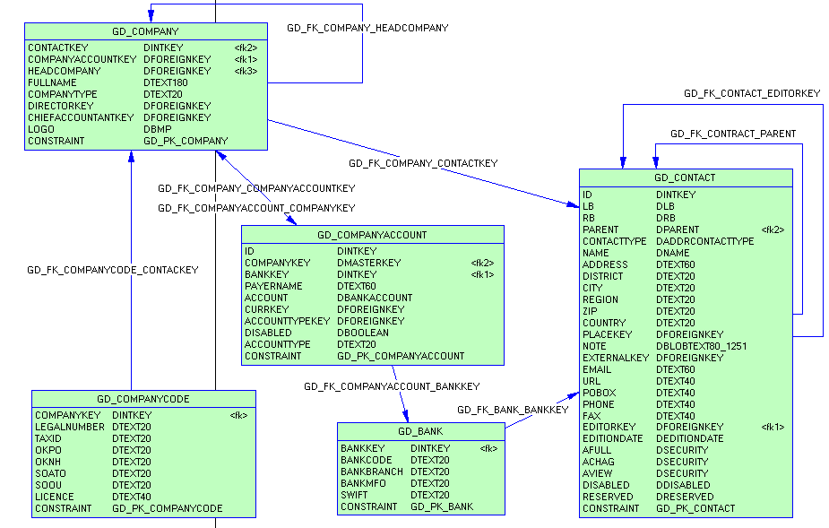
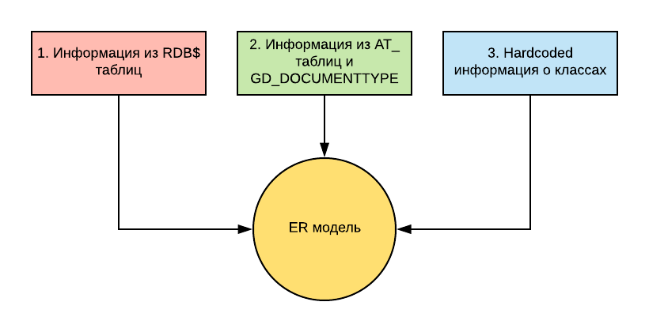
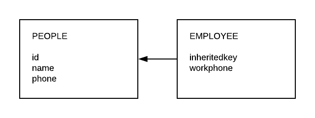
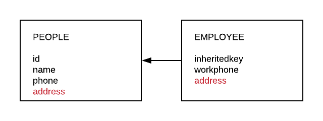

Наличие общих свойств не означает, что объекты принадлежат одному классу или наследуют один другого. Например, и бегемот, и Боинг имеют массу и хвост, но они совершенно различны по своей природе. Если говорить об иерархии наследования, то Боинг стоит в цепочке `Машины → Летательные аппараты → Самолеты`, а бегемот это `Животные → Млекопитающие → Парнокопытные`. 

Не указывает на принадлежность одному классу и участие объекта в схожих процессах. Например, баскетбольный мяч можно *забросить* в кольцо, а можно *швырнуть* в пруд, но от этого ни пруд, не кольцо не породнятся.

В Гедымине *Организация (компания)* и *Физическое лицо* наследуются от одного класса *TgdcBaseContact*. Это **не правильно!** Так сложилось исторически, в силу того, что структура таблиц перекочевала из одной нашей внутренней программы конца 90-х, называвшейся *Звонки*. Как легко догадаться из названия, в ней фиксировались телефонные обращения в наш офис. Если звонивший представлял организацию, нашего клиента, то заносилось обращение от *организации*, если нет -- от *физического лица*. Для группировки контактов были введены специальные объекты: *Папки* и *Группы*, которые хранили в той же таблице GD_CONTACT и наследовали от *TgdcBaseContact*. Хотя ни папка, ни группа, разумеется, никому позвонить не могли.

GDMN не должен копировать ошибки Гедымина. Правильная иерархия классов:

И никакого общего предка! Пусть даже все таблицы указанных классов и завязаны на общую таблицу GD_CONTACT:



### Построение ER модели по структуре базы данных Гедымина

При подключении к реляционной базе данных мы строим ER модель. Схематически данный процесс можно изобразить следующим образом:


1. Таблица превращается в класс (с учетом п.2 и п.3). Наследование мы можем установить по первичному ключу INHERITEDKEY, который одновременно является FK на таблицу родительского класса. По полям и внешним ключам таблицы устанавливаем атрибуты соответствующей сущностии т.п.

2. В at_ таблицах хранится информация о локализации (наименования атрибутов). В таблице GD_DOCUMENTTYPE хранится информация о наследовании типов документов. Не забываем, что в Гедымине в одной таблице могут хранится данные некольких классов документов.

3. Часть информации о структуре бизнес-объектов в Гедымине закодирована разработчиком непосредственно в код бизнес-класса. Например, в таблице GD_CONTACT хранятся данные нескольких классов: Папка, Группа, Организация, Подразделение, Человек и т.п. Только из кода программы можно понять как выделяются записи, например для Групп, из общего массива записей и какие поля используются. Соответственно, и код построения ER модели по реляционной базе платформы Гедымин должен содержать жестко прописанный программный код, который будет создавать и настраивать такого рода сущности.

Пример кода создания сущности "вручную":

```ts
/**
  * Папка из справочника контактов.
  * Основывается на таблице GD_CONTACT, но использует только несколько полей из нее.
  * Записи имеют признак CONTACTTYPE = 0.
  * Имеет древовидную структуру.
  */
const Folder = this._createEntity({
    name: "Folder",
    lName: { ru: { name: "Папка" } },
    adapter: {
        relation: [{
                relationName: "GD_CONTACT",
                selector: {
                    field: "CONTACTTYPE",
                    value: 0
                },
                fields: [
                    Constants_1.Constants.DEFAULT_PARENT_KEY_NAME,
                    "NAME"
                ]
            }]
    }
```

### Роль адаптера

Адаптер для сущности показывает в каких таблицах в реляционной базе находятся её данные. И больше ничего! Разработчик ни коим образом не должен делать никаких предположений о иерархии наследования сущностей или о классе сущности на основе информации из адаптера.

Пример адаптера для сущности *Организация*:

```ts
adapter: {
    relation: [
        {
            relationName: "GD_CONTACT",
            selector: {
                field: "CONTACTTYPE",
                value: 3
            }
        },
        {
            relationName: "GD_COMPANY"
        },
        {
            relationName: "GD_COMPANYCODE",
            weak: true
        }
    ],
    refresh: true
}
```

который говорит нам, что данные организации хранятся в трех таблицах, связанных между собой следующим образом: GD_CONTACT **JOIN** GD_COMPANY **LEFT JOIN** GD_COMPANYCODE.

Параметр refresh указывает нам на то, что в базе данных присутствуют триггеры на указанных таблицах и, соответственно, после записи в базу данных информацию следует *перечитать* для актуализации.

Адаптер для атрибута сущности несет туже смысловую нагрузку -- это поле в таблице или таблица (для множеств), которая хранит данные атрибута.

В целях экономии системных ресурсов, адаптеры могут опускаться в простейших случаях. Например, когда сущность построена на одной таблице и имя сущности совпадает с именем таблицы. Аналогично и для атрибута.

Информация в адаптере полная в том смысле, что заинтересованная сторона может построить SQL запрос к базе данных, на основании сформулированного запроса к сущностям из ER модели, только используя данные из адаптеров, участвующих в запросе сущностей и их атрибутов.

### Формирование списка атрибутов для сущности

Каждая сущность содержит внутри себя **полный** список своих атрибутов. Рассмотрим пример с наследованием. Структура таблиц в базе данных следующая:


На основе указанных таблиц строим иерархию сущностей в ER модели. Ниже приведены имена сущностей и атрибутов и соответствующие адаптеры. В комментарии указано локализованное наименование атрибута, его роль:

```ts
PEOPLE { relation: [ {relationName: "PEOPLE"} ]}
PEOPLE.id { relation: "PEOPLE", field: "ID" }          // идентификатор
PEOPLE.name { relation: "PEOPLE", field: "NAME" }      // ФИО
PEOPLE.phone { relation: "PEOPLE", field: "phone" }    // контактный номер телефона

EMPLOYEE { relation: [ {relationName: "PEOPLE"}, {relationName: "EMPLOYEE"} ] }
EMPLOYEE.id { relation: "PEOPLE", field: "ID" }        // идентификатор
EMPLOYEE.name { relation: "PEOPLE", field: "NAME" }    // ФИО
EMPLOYEE.phone { relation: "PEOPLE", field: "phone" }  // домашний номер телефона
EMPLOYEE.workphone { relation: "EMPLOYEE", field: "workphone" }  // рабочий номер телефона
```

Обратите внимание:

1. Поле INHERITEDKEY отсутствует как атрибут, так как его единственная роль -- связь двух таблиц. Когда агент строит SQL запрос по сущности EMPLOYEE, он из ее адаптера знает, что данные сущности лежат в таблицах PEOPLE и EMPLOYEE. Ему остается посмотреть в структуре реляционной базы первичный ключ (PK) таблицы EMPLOYEE, который одновременно **должен** являться и внешним ключем на таблицу PEOPLE и сформировать запрос вида:

```sql
FROM
  PEOPLE p JOIN EMPLOYEE e on p.ID = e.INHERITEDKEY
```

2. Поле PEOPLE.PHONE в сущности EMPLOYEE имеет смысл **Домашний номер телефона** в противоположность **Рабочему номеру**. 

В приведенном выше примере адаптеры для сущности PEOPLE и ее атрибутов могут быть опущены, так как имя сущности и ее атрибутов совпадает с именем таблицы и полей. 

### Поля с одинаковыми именами

Следует избегать полей с одинаковыми именами в разных таблицах, образующих одну сущность. Но, если такая ситуация встретилась, как, например, на схеме ниже:



то поле из более общей таблицы ИГНОРИРУЕТСЯ:

```ts
PEOPLE { relation: [ {relationName: "PEOPLE"} ]}
PEOPLE.id { relation: "PEOPLE", field: "ID" }           // идентификатор
PEOPLE.name { relation: "PEOPLE", field: "NAME" }       // ФИО
PEOPLE.phone { relation: "PEOPLE", field: "phone" }     // контактный номер телефона
PEOPLE.address { relation: "PEOPLE", field: "address" } // адрес

EMPLOYEE { relation: [ {relationName: "PEOPLE"}, {relationName: "EMPLOYEE"} ] }
EMPLOYEE.id { relation: "PEOPLE", field: "ID" }         // идентификатор
EMPLOYEE.name { relation: "PEOPLE", field: "NAME" }     // ФИО
EMPLOYEE.phone { relation: "PEOPLE", field: "phone" }   // домашний номер телефона
EMPLOYEE.workphone { relation: "EMPLOYEE", field: "workphone" }  // рабочий номер телефона
EMPLOYEE.address { relation: "EMPLOYEE", field: "address" }  // адрес
```

Очевидно, чтобы избежать ошибок при вставке, такое поле в более общей таблице не должно быть помечено как NOT NULL или иметь установленное DEFAULT значение.


