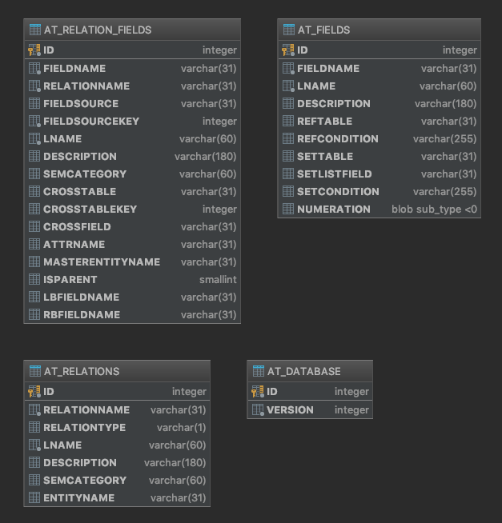

## Миграция структуры базы данных.  
При подключении gdmn-back к БД следует проверять ее на актуальность структуры данных.  
* `versionDB` - версия (число), хранящееся внтури базы данных
* `appVersionDB` - версия (число), хранящееся в приложении

Случаи когда нужно обновлять структуру БД:
  1. при загрузке чистой БД (`versionDB === undefined`).
  2. при загрузке существующей БД гедымина (`versionDB === undefined,` но существуют некоторые структурные `AT_` таблицы).
  3. при загрузке существующей БД, версия которой меньше текущей версии БД в приложении (`versionDB < appVersionDB`).
  
Обновление структуры БД должно выполняться через реализацию интерфейса взаимодействия (**gdmn-er-bridge**) 
с базой данных для **gdmn-orm**. Другими словами через вызовы каких-то методов у **gdmn-orm**.   
Например `erModel.createEntity(...)` или `entity.deleteAttribute(...)`.

### Сделать
  1. интерфейс взаимодействия с БД для **gdmn-orm** и его реализацию в **gdmn-er-bridge**
  2. миграция пользовательских и служебных таблиц через один алгоритм
  
#### Что уже есть

  1. структура данных для работы **gdmn-orm**:
  
  
    
    Дополнительные поля стандартной таблицы `AT_RELATION_FIELDS`
      * ATTRNAME - имя атрибута с определенным адаптером, в котором имя атрибута не совпадает с именем поля
      * MASTERENTITYNAME - имя master сущности, на основную таблицу которой, ссылается данный relationField
      * ISPARENT - флаг parent ссылка
      * LBFIELDNAME - имя поля для левой границы из адаптера, если оно не совпадает с дефолтным (`LB`)
      * RBFIELDNAME - имя поля для правой границы из адаптера, если оно не совпадает с дефолтным (`RB`)
      
    Дополнительные поля стандартной таблицы `AT_RELATIONS`
      * ENTITYNAME - имя сущности с определенным адаптером, в котором имя сущности не совпадает с именем основной таблицы
      
    Дополнительная таблица `AT_DATABASE`
      * ID - идентификатор
      * VERSION - версия БД
      
  2. миграция служебных `AT_` таблиц (тукущая версия БД = 5)
    
      Обновлением структуры занимается класс `gdmn-er-bridge/src/ddl/updates/UpdateManager.ts`, 
    он сверяет версии и если требуется, запускает `gdmn-er-bridge/src/ddl/updates/Update${version}.ts` 
    для нужных версий. Для обновления структуры служебных таблиц нужно вызвать:
```ts
  await erModel.initDataSource(new DataSource(connection));
```
  
#### Что в процессе
 Создание интерфейса взаимодействия с источником данных для **gdmn-orm** и его реализации
