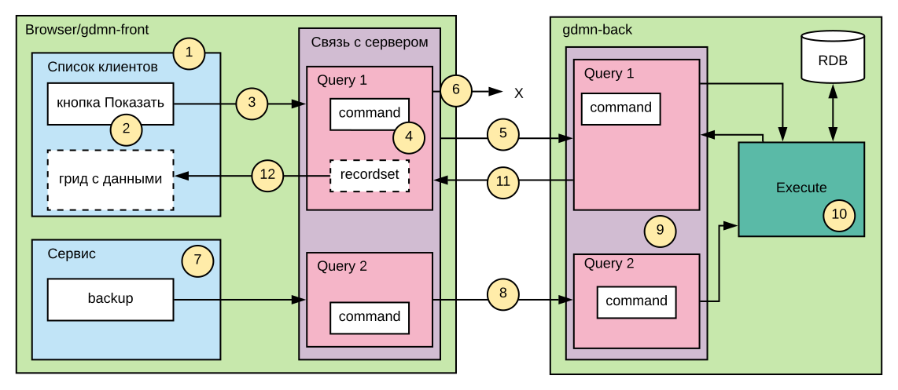

Это фрагмент взаимодействия между клиентом (gdmn-front) и сервером (gdmn-back). Мы опускаем моменты установления канала связи, аутентификации пользователя и т.п.

Все предложения по организации интерфейса пользователя это только предложения, сделанные здесь для схематической иллюстрации взаимодействия систем и человека.



1. Внутри браузера пользователь открывает страницу **Список клиентов**. 
2. Указывает параметры фильтрации, например, _"все клиенты из Минска"_ и нажимает кнопку **Показать**. 
3. Формируется объект Query, который внутри содержит команду запроса данных:
```ts
{
  state: ready-to-send,
  commands: [
    {
      action: 'SHOW',
      objects: [
        {
          entity: Company,
          conditions: [
            {
              attr: placekey,
              op: 'HASROOT',
              value: 'Минск'
            }
          ]
        }
      ]
    }
  ]
}
```
4. Объект передается подсистеме, отвечающей за связь с сервером.
5. Подсистема смотрит, есть ли у нас сейчас связь (подключение к интернету) и если есть, то передает объект **Query** серверу. Соответственно, изменяет его состояние на передано и оповещает об этом интерфейс пользователя -- гасим кнопку **Показать** и выводим песочные часы показывая, что идет процесс обращения к серверу.
```ts
{
  state: sent,
  ...
}
```
6. Если связи нет, то будем какое-то время ждать появление канала связи. Оповещаем интерфейс пользователя. Например, выводим там мигающее сообщение, что ожидаем связи с сервером. У пользователя появляется кнопка вообще прервать процесс отсылки, что приведет к удалению **Query** из списка.
7. Пока сервер обрабатывает наш запрос пользователь может ждать, а может и пойти на любую другую страницу. Например, он пошел на страницу **Сервис** и выбрал команду создать архивную копию базы данных. Аналогичным образом сформировался объект **Query** и передался системе для отсылки на сервер:
```ts
{
  state: ready-to-send,
  commands: [
    {
      action: 'BACKUP',
      fileName: 'new backup'
    }
  ]
}
```
8. Отсылка на сервер происходит аналогичным образом.

Теперь, на клиенте, у нас в списке выполняемых команд два объекта и на двух страницах висят песочные часы и возможно выводится текстовая подсказка, что ожидаем ответа от сервера.

Посмотрим что происходит на сервере:

9. Некая подсистема идентифицирует каждую команду поступившую извне и соотносит ее с объектами **DB Connection** и **Session**. Найдя соответствие, помещает ее в список команд соответствующей сессии. Возможно, список команд будет один и только механизм выполнения команды будет брать нужные для нее объекты **DB Connection** и **Session** непосредственно в момент выполнения.
10. Некий механизм следит за списком (списками) команд и как только там что-то появляется начинает их выполнять.
11. После того как команда выполнена, сервер готовит ответ и тосылает его на клиента. Ответ может содержать не только статус выполнения команды Успех/Ошибка, но и все, относящиеся к ней данные. Например, рекордсет для команды выборки из базы данных.
12. Клиент получив ответ от сервера, меняет статус объекта **Query**, наполняет его полученными данными и оповещает интерфейс пользователя.
13. На этом жизненный цикл объекта **Query** закончен, он убирается из списка и уничтожается.

В зависимости от установленных параметров очередь на клиенте (в браузере) может держать сообщения достаточно долго, даже сохраняя их в локал сторадж. Можно представить себе сценарий,при котором торговый агент входит в приложение. В процессе начальной загрузки скачиваются справочники клиентов, товаров, складские остатки цены и т.п. Дальше, целый день, агент работает у клиентов не имея конекта к сети. Каждая составленная им заявка превращается в объект **Query**, который помещается в очередь и ждет пока появится связь. Как только связь появилась -- объекты пересылаются на сервер и записываются в базу данных. Или возникают ошибки, о чем информируется пользователь.