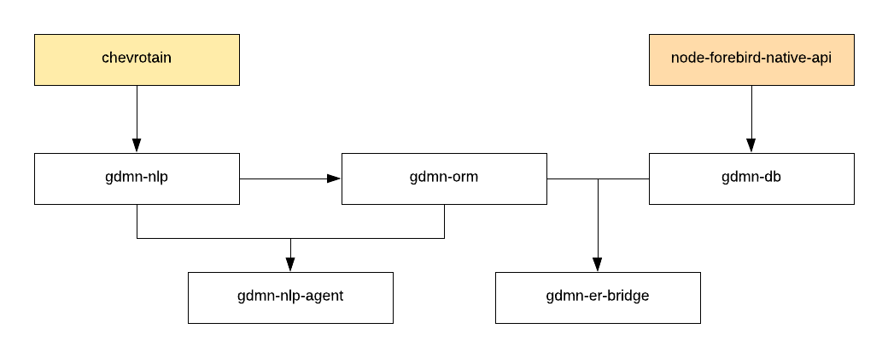
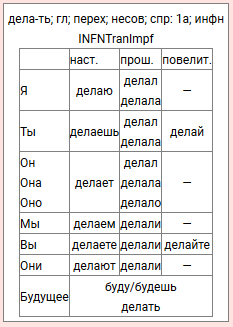
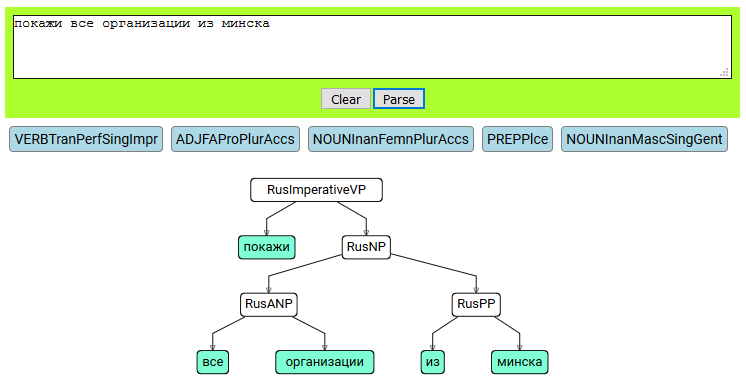
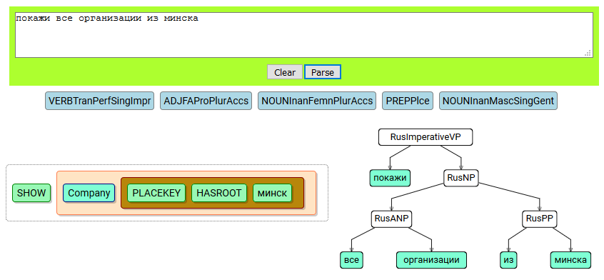

Первый этап проекта __GDMN__ можно считать успешно завершенным. Подведем итоги: 

1. Для серверной части проекта мы остановились на технологии [nodejs](http://nodejs.org), которая позволяет создавать и использовать изоморфный код как на стороне сервера, так и на клиенте — в браузере. Это позволяет нам гибко эксперементировать с архитектурой проекта. Например, код обработки языка сейчас полностью выполняется в браузере, но в будущем легко и в неизменном виде может быть перенесен на сервер. 
2. Язык программирования — [TypeScript](http://typescriptlang.org). Из-за строгой типизации и "человеческого" синтаксиса ООП. И еще потому что его автор Anders Hejlsberg. Должна же у нас остаться хоть какая-то связь с Delphi ;)
3. База данных — [Firebird](http://firebirdsql.org). По крайней мере на первом этапе __GDMN__ будет сохранять преемственность в плане структуры БД с Гедымином. В будущем будет добавлена поддержка других РСУБД. Для этого мы закладываем промежуточный слой абстракции в библиотеке gdmn-db. Драйвер для доступа к БД — [node-firebird-native-api](https://github.com/asfernandes/node-firebird-native-api).
4. Клиентская часть — [React](http://reactjs.org) + [Redux](http://redux.js.org). Библиотека визуальных компонентов [Material-UI](http://material-ui.com).
5. Сборка проекта — [Webpack](https://webpack.js.org/).
6. Автоматическое тестирование — [Jest](https://facebook.github.io/jest/).

## Библиотеки

Каждую библиотеку мы оформляем в отдельный репозиторий на guthub.com и стараемся делать максимально независимой от других библиотек проекта.

### Диаграма связей библиотек



### [gdmn-nlp](https://github.com/gsbelarus/gdmn/tree/master/packages/gdmn-nlp)

Обработка естественного языка. Состоит из следующих блоков:

* Морфология
* Синтаксис
* Семантика

Морфологический блок работает по методу основ. В словаре хранятся лексемы, которые определяют часть речи и ее неизменные характеристики. Лексема задается основой слова (несколькими основами, в случае чередования звуков). Пример, для прилагательного _минский_:

```typescript
  {
    stem: 'минск',
    stem1: '',
    stem2: '',
    category: RusAdjectiveCategory.Rel,
    declensionZ: '3a'
  },
```

Здесь мы видим, что неизменные характеристики прилагательного — склонение и категория. В данном случае — _3а_ (по Зализняку) и _"Относительное прилагательное"_. Характеристики лексемы всегда можно сверить по онлайн словарю [wiktionary.org](https://ru.wiktionary.org/wiki/%D0%BC%D0%B8%D0%BD%D1%81%D0%BA%D0%B8%D0%B9).

Библиотека предоставляет функцию __morphAnalyzer__, которая по заданному слову возвращает массив возможных словоформ. Например, для слова _Минск_ возможные словоформы:

1. Минск — сущ, ед.ч., муж.род, им.п.
2. Минск — сущ, ед.ч., муж.род, вин.п. 

Словоформы в данном случае — это объекты типа __RusNoun__, иерархия наследования для которого:

Word -> Noun -> RusNoun

Аналогично, существуют классы для прилагательных, глаголов, предлогов, союзов и т.п.

Класс для слова (словоформы) содержит ссылку на объект соответствующей лексеммы (наследник корневого класса __Lexeme__). Класс лексемы включает метод __getWordForm__, который возвращает словоформу для заданной лексемы по указанным морфологическим признакам.

Таким образом мы можем решать как прямую задачу морфологического разбора — по слову определить его часть речи и морфологические признаки, так и обратную — по лексеме и заданным признакам построить конкретную словоформу.

Пример разбора глагола "делать" и построения всех его слоформ:



Синтаксическая часть решает задачу разбора предложения. Результат разбора — объект типа Phrase, который, в свою очередь, может содержать другие фразы и/или слова.

Пример разбора предложения _"Покажи все организации из Минска"_:



Разбор осуществляется в следующей очередности:

1. Производится морфологический анализ каждого слова в предложении.
2. Предложение превращается в массив объектов токенов. Тип токена определяется строковой сигнатурой словоформы (например, _VERBTranPerfSingImpr_ — глагол, переходный, совершенный, ед. ч., повелительное наклонение). Токен содержит исходное слово.
3. Для парсинга предложения (массива токенов) мы используем библиотеку [Chevrotain](https://github.com/SAP/chevrotain).
4. Результат парсинга — объект CST (Concrete Syntax Tree).
5. С помощью специального объекта CstVisitor происходит обход дерева и формирование иерархии объектов типа Phrase и Word. CstVisitor создается автоматически на основе грамматики методом парсера _getBaseCstVisitorConstructor_.

Семантическая часть заключается в назначении семантической категории (категорий) каждой лексеме. Например, существительное Минск имеет семантическую категорию _SemCategory.Place_ — место.

В дальнейшем, благодаря семантическим категориям, мы сможем определять синонимы, антонимы, гиперонимы и гипонимы для заданного слова.

### [gdmn-db](https://github.com/gsbelarus/gdmn/tree/master/packages/gdmn-db)

Библиотека содержит:

1. Набор классов для доступа к реляционной базе данных.
2. Набор классов для считывания и представления структуры реляционной базы данных.
3. Драйвер для доступа к СУБД Firebird (в свою очередь использует внешнюю библиотеку node-firebird-native-api).

gdmn-db — это промежуточный слой абстракции, который позволит нам не менять весь остальной код при переходе с одного сервера базы данных на другой.

### [gdmn-orm](https://github.com/gsbelarus/gdmn/tree/master/packages/gdmn-orm)

Набор классов для представления ER модели данных:

* ERModel
* Entity — сущность
* Attribute — базовый класс для атрибутов. Поддерживаются как скалярные типы (Число, Строка, Дата, Время, Булевский и др), так и типы: Ссылка на объект, Ссылка на родительский уровень, Множество, Детальный набор данных, Перечисление.

ERModel может быть сериализована в JSON файл и загружена из такого файла. Сейчас таким образом передается модель из серверной части gdmn-back в gdmn-front.

Соответствие между объектами модели (сущностями и атрибутами) и таблицами и полями в реляционной базе данных задается через объекты-адаптеры.

Ниже приведен пример адаптера для сущности _Банк_, которая в [структуре базы данных Гедымина](http://gsbelarus.com/gs/wiki/index.php/%D0%A1%D0%B2%D1%8F%D0%B7%D0%B8_%D1%82%D0%B0%D0%B1%D0%BB%D0%B8%D1%86_%D1%81%D0%BF%D1%80%D0%B0%D0%B2%D0%BE%D1%87%D0%BD%D0%B8%D0%BA%D0%B0_%D0%BA%D0%BE%D0%BD%D1%82%D0%B0%D0%BA%D1%82%D0%BE%D0%B2) хранится в четырех таблицах: GD_CONTACT, GD_COMPANY, GD_BANK, GD_COMPANYCODE.

```typescript
    {
      relation: [
        {
          relationName: 'GD_CONTACT',
          selector: {
            field: 'CONTACTTYPE',
            value: 5
          }
        },
        {
          relationName: 'GD_COMPANY'
        },
        {
          relationName: 'GD_COMPANYCODE',
          weak: true
        },
        {
          relationName: 'GD_BANK'
        }
      ],
      refresh: true
    }
```

Каждому объекту сущности и каждому атрибуту сопоставляются семантические категории.

### [gdmn-er-bridge](https://github.com/gsbelarus/gdmn/tree/master/packages/gdmn-er-bridge)

Как следует из названия — мост между реляционной базой данных платформы Гедымин и ER моделью. 

Предоставляет функцию _erExport_, которая принимает на вход объекты со структурой БД, подключение и транзакцию и возвращает сформированный объект типа ERModel. 

### [gdmn-nlp-agent](https://github.com/gsbelarus/gdmn/tree/master/packages/gdmn-nlp-agent)

Библиотека решает задачу выделения смысла из фразы на естественном языке на основе знаний из ER модели и построения команды, пригодной для дальнейшего выполнения.

Пример построенной команды для предложения "Покажи все организации из Минска":



Алгоритм преобразования фразы в команду следующий:

1. Выполняем синтаксический разбор. На выходе получаем повелительное глагольное предложение.
2. Ищем агента, способного выполнить команду ПОКАЖИ в контексте доступа к базе данных.
3. Передаем агенту фразу и ERModel.
4. Агент ищет в ER модели сущность, соответствующую подлежащему ОРГАНИЗАЦИИ. Поиск идет через сопоставление семантической категории существительного и сущности.
5. Агент анализирует предлог ИЗ и определяет, что это предлог МЕСТА.
6. Агент ищет в сущности ОРГАНИЗАЦИЯ атрибут, имеющий семантическую категорию ObjectLocation.
7. Найдя такой атрибут (PLACEKEY), агент определяет что это ссылка на объект и что данные объекта имеют древовидную структуру. Соответственно, агент выбирает операцию HASROOT.

## [gdmn-back](https://github.com/gsbelarus/gdmn/tree/master/src/gdmn-back)

Серверная часть платформы GDMN. На сегодняшний день выполняет следующие функции:

1. Подключение к базе данных.
2. Считывание структуры реляционной базы данных.
3. Построение ER модели по структуре базы данных платформы Гедымин.
4. Построение GraphQL схемы по ER модели.
5. Выдача сериализованной ER модели (REST end point /er).
6. GrahQL playground (доступ по корневому URL. Подробнее, см. подсказку при запуске проекта).
7. Обработку команд фронтальной части. Выполнение SQL запросов и передача данных.

Запускается командой `yarn start`.

## [gdmn-front](https://github.com/gsbelarus/gdmn-front)

Фронтальная, клиентская часть. После установки запускается командой `npm start`.

В настоящее время просто тестовая площадка для экспериментов с обработкой естественного языка и отображением данных.

Для загрузки ER модели требует запущенного сервера gdmn-back.


